# drf 认证总结及源码
## 一. 认证执行逻辑
### 1. 自定义认证类
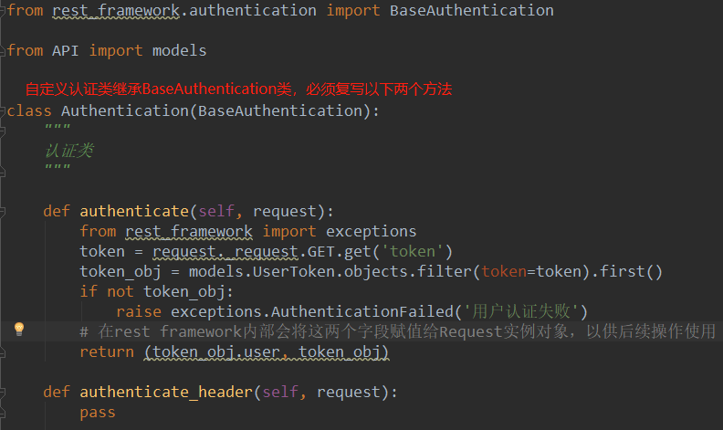
### 2. CBV视图类指定认证类
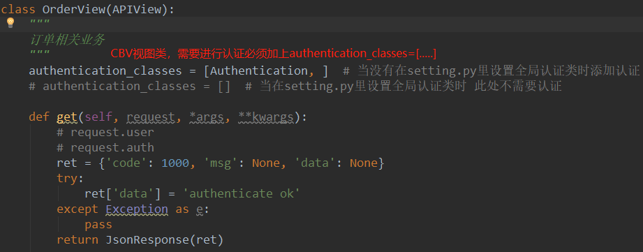
### 3. 在Django setting.py中设置全局认证类
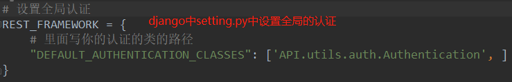
### 4. 在Django的路由中配置路由urls.py
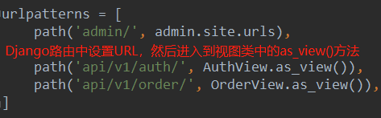
### 5. 执行顺序
1 当有...api/v1/order/get?token=....请求时。  
2 先进行路由匹配执行匹配到的视图类OrderView的as_view()方法  
3 由于OrderView中没有as_view()方法，则执行其父类APIView中的as_view()方法  
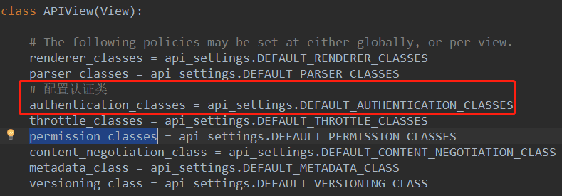
APIView.as_view()方法
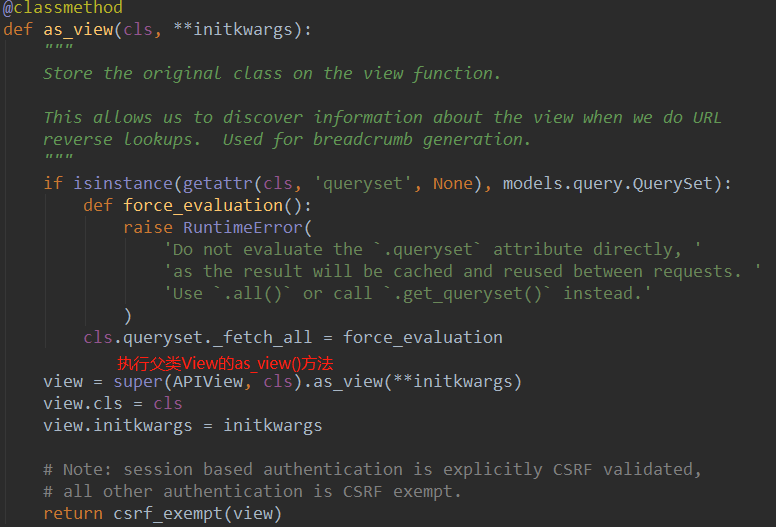  
4 在执行APIView中的as_view()方法时去执行其父类View中的as_view()方法。View是Django中的类(from django.views import View)  

5 由于APIView中复写了dispatch()方法那么执行APIView中的dispatch方法  
6 request = self.initialize_request(request, *args, **kwargs)将Django原生的request封装成drf的request  
  
7 获取authentication_classes = [...] 中认证类的实例对象并作为参数传入Request  
都是APIView类中的方法
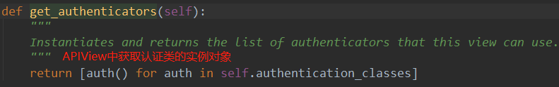
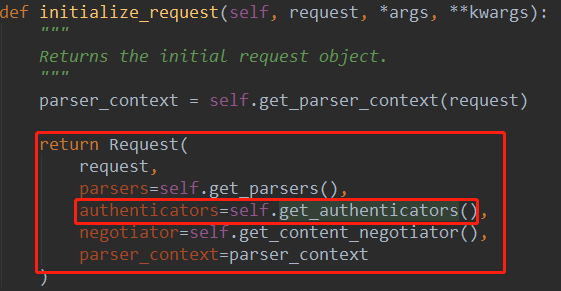  
8 在APIView dispatch中self.initial(request, *args, **kwargs)
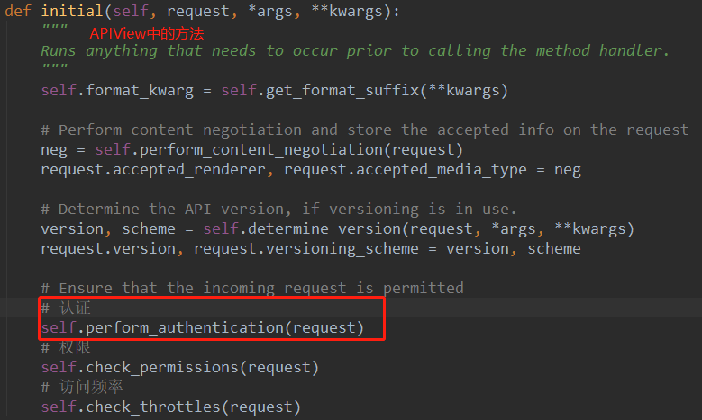
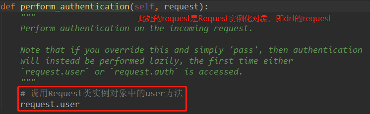  
9 执行request.py中Request实例对象中的user方法  
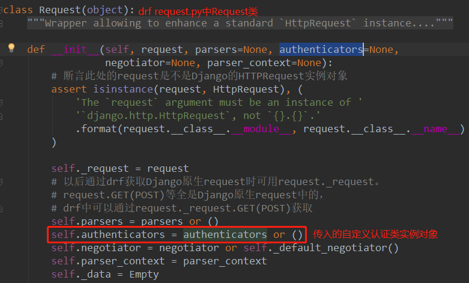  
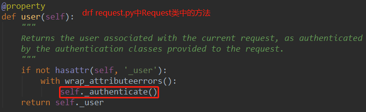
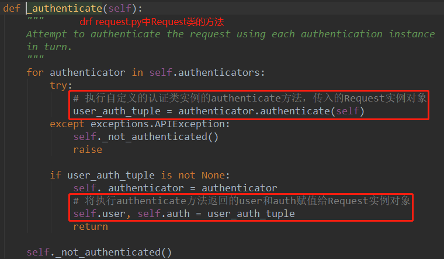

